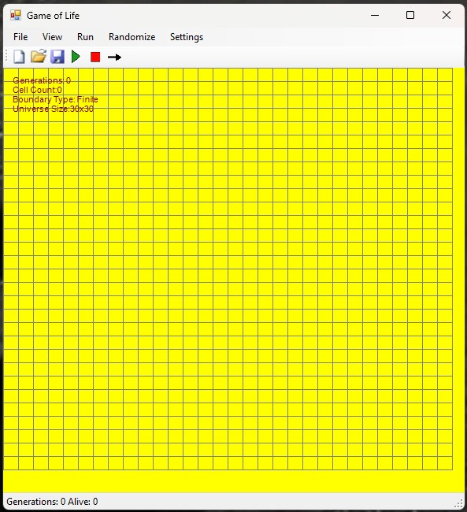
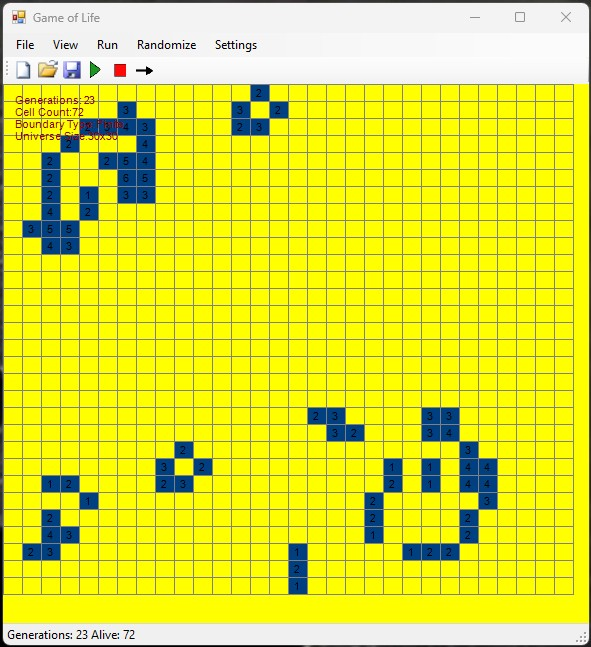
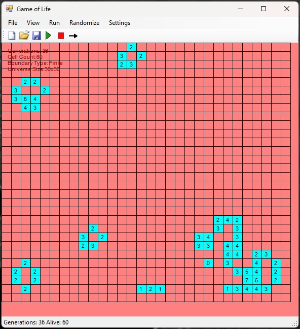
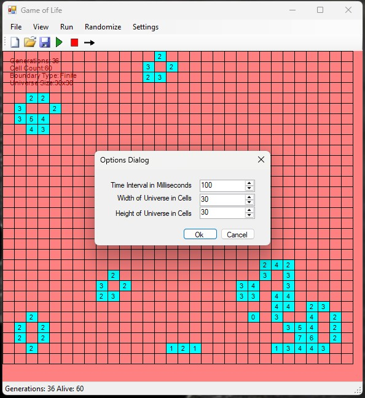

# ConwaysGameOfLife
This is a fully interactive desktop version of Conway’s Game of Life, built in C# using WinForms. It started as a portfolio project, and I treated it like my first serious attempt at a polished software tool.

## 💡 Why This Project Matters

Being one of my earliest deep dives into C# and .NET, and built in a single month during my Project & Portfolio course, it challenged me to go beyond simple UI work and into simulating real logic-driven systems. It’s also where I learned how to balance front end with backend rules, which becomes a recurring pattern in dev work.

The project reflects my ability to:
- Work independently with partially provided UI resources
- Translate algorithmic rules into functional code
- Integrate user input, state management, and real-time feedback
- Use Git and version control tools professionally

## 🚀 Software Features

- Click to toggle cells on a grid
- Start / Pause / Step through simulation
- Randomize with a timer or custom seed
- Save/load universe states as PlainText
- Adjustable universe size, simulation speed, and cell colors
- Toroidal (wrap-around) or finite universe options
- Live status bar showing generations and living cells
- Context menu and persistent user settings
  
## 📸 Screenshots

  
  

  
  

## 🎥 Video Demo

## 🛠️ How to Run

1. Download the ZIP of this repository or clone it via Git.

2. Unzip (if downloaded) and open the solution file MyGOL.sln in Visual Studio 2019 or later.

3. Build and run the project.

4. Use the menu strip to Start, Pause, or advance one generation at a time.

5. Explore options via the View menu and context-sensitive right-click menu.

## 📁 Files

- `MyGOL.sln` — Main app logic
- `images/` — Screenshots and icons
- `ReadMe.txt` — Notes
- `LICENSE` — MIT License

## 📌 Acknowledgements

UI layout, button design, and some front-end scaffolding were provided by the course instructor at Full Sail University.

All backend logic, simulation behavior, state handling, save/load systems, and custom features were designed and implemented independently.

This was one of the first projects where I felt like a real developer, seeing logic and UI come together in a smooth user experience.

Feel free to explore the code or reach out if you'd like to know more about the project.

## 📝 License

This project is licensed under the [MIT License](LICENSE).
